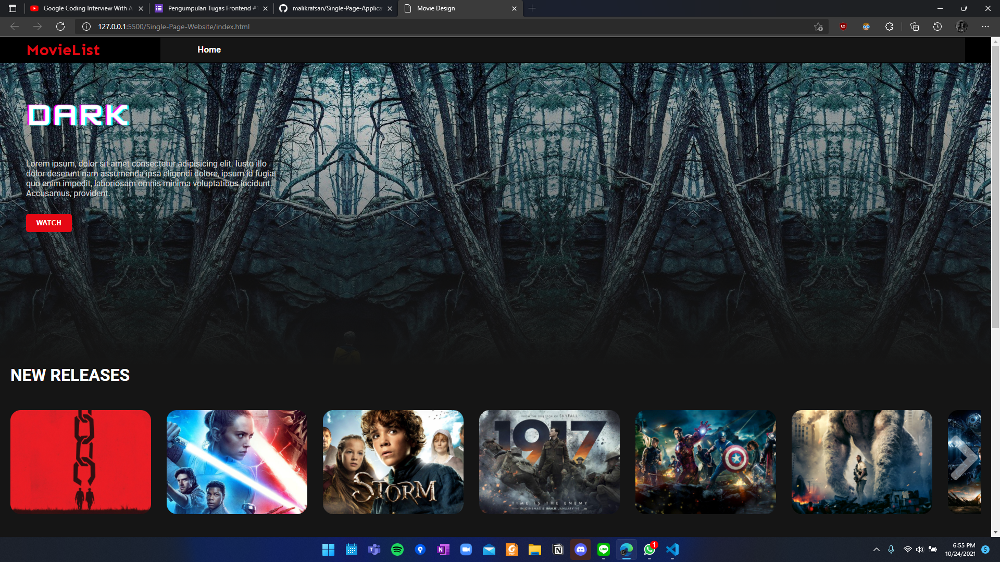
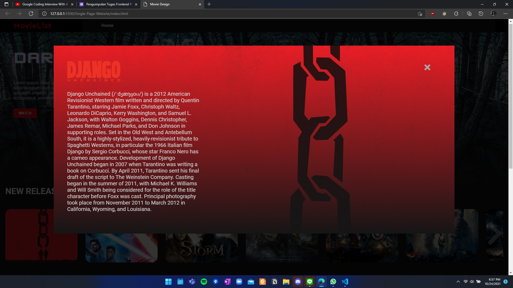

# Single Page Application Vanilla TypeScript

## Table of Contents
  - [Description](#description)
  - [Screenshots](#screenshots)
  - [Usage](#usage)
  - [Acknowledgements](#acknowledgements)
  - [Developer](#developer)

## Description
> This project is a single page application website which an app with only 1 page HTML. The HTML is injected different codes when the user accesses different pages. This project is developed using Vanilla Js

## Screenshots

## Usage
You can run this website by:
 Open the `index.html` by using live server or just open it using file explorer

## Acknowledgements
> This project is developed for Google Developer Student Club (GDSC) Institut Teknologi Bandung (ITB)

## Developer
> Samuel Christopher Swandi